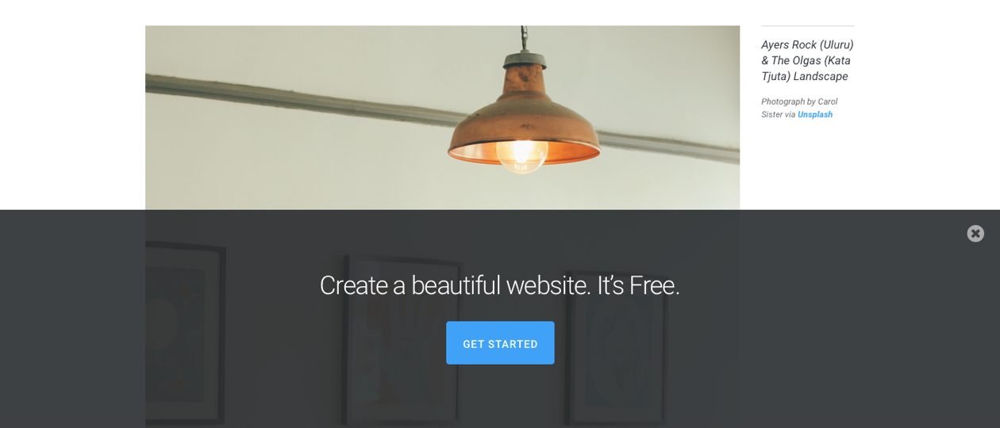

# Banner

A simple CTA Banner that is fixed to the bottom of the page.

## How to Install Banner
1. Create a new page.
2. Create a row.
3. Create a code module.
4. Copy and paste the code below.

```html
<!-- Styles -->
<style>
  .at-banner {
    z-index: 100;
    position: fixed;
    bottom: 0;
    left: 0;
    display: -webkit-box;
    display: -webkit-flex;
    display: -ms-flexbox;
    display: flex;
    -webkit-box-align: center;
    -webkit-align-items: center;
        -ms-flex-align: center;
            align-items: center;
    -webkit-box-orient: horizontal;
    -webkit-box-direction: normal;
    -webkit-flex-direction: row;
        -ms-flex-direction: row;
            flex-direction: row;
    background: rgba(41, 44, 47, 0.9);
    width: 100%;
    height: 300px;
    padding: 20px;
    box-sizing: border-box;
    text-align: center;
    -webkit-transition: 0.3s ease;
    transition: 0.3s ease;
  }
  .at-banner--hidden {
    opacity: 0;
    visibility: hidden;
  }
  .at-banner__content {
    width: 100%;
  }
  .at-banner__title {
    margin: 0 0 26px;
    color: #FFF;
    font-size: 2.25rem;
    font-weight: 300;
    line-height: 3.625rem;
  }
  .at-banner__btn {
    display: inline-block;
    background: #3FA2F7;
    border-radius: 4px;
    padding: 20px;
    color: #FFF;
    font-size: 0.9375rem;
    font-weight: 600;
    line-height: normal;
    text-align: center;
    text-decoration: none;
    text-transform: uppercase;
  }
  .at-banner__close {
    position: absolute;
    top: 22px;
    right: 22px;
    fill: #AAA;
    -webkit-transition: 0.3s ease;
    transition: 0.3s ease;
    cursor: pointer;
  }
  .at-banner__close:hover {
    fill: #FFF;
  }
</style>

<!-- Banner -->
<div class="at-banner">
  <!-- Banner Content -->
  <div class="at-banner__content">
    <!-- Title -->
    <div class="at-banner__title">Create a beautiful website. It’s Free.</div>

    <!-- CTA Button -->
    <a href="#" class="at-banner__btn">Get Started</a>

    <!-- Close Button -->
    <svg width="24" height="24" viewBox="0 0 24 24" xmlns="http://www.w3.org/2000/svg" class="at-banner__close">
      <path d="M17.953 15.531a.961.961 0 0 0-.297-.703L14.828 12l2.828-2.828a.961.961 0 0 0 .297-.703.979.979 0 0 0-.297-.719L16.25 6.344a.979.979 0 0 0-.719-.297.961.961 0 0 0-.703.297L12 9.172 9.172 6.344a.961.961 0 0 0-.703-.297.979.979 0 0 0-.719.297L6.344 7.75a.979.979 0 0 0-.297.719c0 .27.099.505.297.703L9.172 12l-2.828 2.828a.961.961 0 0 0-.297.703c0 .282.099.521.297.719l1.406 1.406a.979.979 0 0 0 .719.297c.27 0 .505-.099.703-.297L12 14.828l2.828 2.828a.961.961 0 0 0 .703.297c.281 0 .521-.099.719-.297l1.406-1.406a.979.979 0 0 0 .297-.719zM24 12c0 2.177-.536 4.185-1.61 6.023a11.946 11.946 0 0 1-4.367 4.368C16.185 23.464 14.177 24 12 24c-2.177 0-4.185-.536-6.023-1.61a11.946 11.946 0 0 1-4.368-4.367C.536 16.185 0 14.177 0 12c0-2.177.536-4.185 1.61-6.023a11.946 11.946 0 0 1 4.367-4.368C7.815.536 9.823 0 12 0c2.177 0 4.185.536 6.023 1.61a11.946 11.946 0 0 1 4.368 4.367C23.464 7.815 24 9.823 24 12z" fill-rule="evenodd"></path>
    </svg>
  </div>
</div>

<!-- Scripts -->
<script>
  jQuery(document).ready(function($) {
    $('.at-banner__close').on('click', function(e) {
      $(this).parent().parent().addClass('at-banner--hidden');
    });
  });
</script>
```

## Credits
- [Mario Maruffi](https://dribbble.com/MarioMaruffi)
- [Andy Tran](http://codepen.io/andytran/)

-
Created by [Andy Tran](http://andytran.me) on Apr. 28th, 2016.