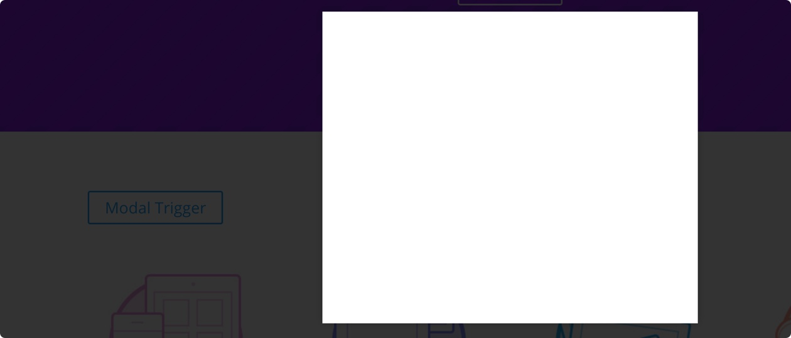

# Modal Snippet

A simple modal popup snippet.

## How to Install Modal
1. Create a new page.
2. Create a row.
3. Create a code module.
4. Copy and paste the code below.

```html
<!-- Styles -->
<style>
  .custom--overlay {
    z-index: 10000;
    position: fixed;
    top: 0;
    left: 0;
    display: none;
    background: rgba(0,0,0,0.8);
    width: 100%;
    height: 100%;
  }

  .custom--overlay.visible {
    display: block;
  }

  .custom--modal {
    z-index: 15000;
    position: fixed;
    top: 50%;
    left: 50%;
    display: none;
    background: #FFF;
    box-shadow: 0 0 15px rgba(0,0,0,0.2);
    width: 480px;
    height: 400px;
    transform: translate(-50%, -50%);
  }

  .custom--modal.visible {
    display: block;
  }

  .custom--trigger {
    cursor: pointer;
  }
</style>

<!-- Trigger -->
<a class='et_pb_button custom--trigger'>
  Modal Trigger
</a>

<!-- Overlay -->
<div class='custom--overlay'></div>

<!-- Custom Modal -->
<div class='custom--modal'>
  <!-- Content Here -->
</div>

<!-- Scripts -->
<script>
  jQuery(document).ready(function($){
    var customTrigger = $('.custom--trigger'),
      customOverlay = $('.custom--overlay'),
      customModal = $('.custom--modal');

    function overlayRemove() {
      customOverlay.on('click', function() {
        $(this).fadeOut(300, 'swing').removeClass('visible');

        customModal.fadeOut(300, 'swing').removeClass('visible');
      });
    }

    customTrigger.on('click', function(e) {
      e.preventDefault();

      customOverlay.fadeIn(300, 'swing').addClass('visible');

      customModal.fadeIn(300, 'swing').addClass('visible');

      overlayRemove();
    });
  });
</script>
```

## Credits
- [Mario Maruffi](https://dribbble.com/MarioMaruffi)
- [Andy Tran](http://codepen.io/andytran/)

-
Created by [Andy Tran](http://andy.design) on Feb. 11nd, 2016.